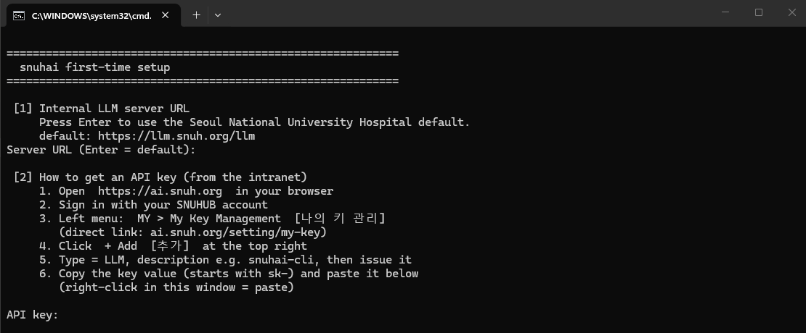

# SNUHAI CLI

**Use [OpenAI Codex CLI](https://github.com/openai/codex) contra su propio servidor LLM
interno, en equipos aislados (air-gapped) sin acceso a Internet.**

[한국어](README.md) · [English](README.en.md) · [中文](README.zh-CN.md) · **Español**

Creado para la red interna del Hospital Universitario Nacional de Seúl (SNUH), pero
funciona con **cualquier servidor LLM interno que exponga una API compatible con OpenAI**.

---

## Inicio rápido

**① En un equipo con Internet, una sola vez** — genere el paquete.

```bat
git clone https://github.com/vitaldb/snuhai-cli.git
cd snuhai-cli
make_snuhai.bat
```

```bash
./make_snuhai.sh          # para generarlo desde Linux/macOS
```

Se crea un único `snuhai-cli.zip` (~180 MB).

**② Copie ese ZIP al equipo aislado**, descomprímalo y haga doble clic en `snuhai.bat`.

```
snuhai-cli/
├── snuhai.bat        ← lo único que se ejecuta (Windows)
├── snuhai.sh         ← Linux
└── .snuhai/          ← todo lo necesario (no lo borre)
```

**No hace falta instalar nada previamente** en el equipo destino, ni siquiera Node.js.

---

## Primera ejecución

Pregunta tres cosas una sola vez; a partir de ahí arranca directamente.



```console
============================================================
  snuhai first-time setup
============================================================

 [1] Internal LLM server URL
     Press Enter to use the Seoul National University Hospital default.
     default: https://llm.snuh.org/llm
Server URL (Enter = default):

 [2] How to get an API key (from the intranet)
     1. Open  https://ai.snuh.org  in your browser
     2. Sign in with your SNUHUB account
     3. Left menu:  MY > My Key Management  [나의 키 관리]
        (direct link: ai.snuh.org/setting/my-key)
     4. Click  + Add  [추가]  at the top right
     5. Type = LLM, description e.g. snuhai-cli, then issue it
     6. Copy the key value (starts with sk-) and paste it below
        (right-click in this window = paste)

API key:

 Fetching available models...
Model name:
```

*(Las etiquetas coreanas entre corchetes corresponden a lo que verá en el sitio SNUH.AI.)*

La configuración se guarda en `%USERPROFILE%\.snuhai` (Linux: `~/.snuhai`).

## Uso

Los argumentos se pasan tal cual a codex.

```bat
snuhai.bat                                      :: modo interactivo
snuhai.bat exec "explica qué hace este repositorio"
```

---

## Cómo funciona

Las versiones recientes de Codex CLI solo admiten la **Responses API**
(`wire_api = "chat"` se eliminó en febrero de 2026). Pero vLLM y litellm —los despliegues
internos habituales— a menudo solo ofrecen **Chat Completions**.

Al arrancar, `snuhai` **comprueba si su servidor admite la Responses API**:

- si la admite → conexión **directa**
- si no → inicia **la pasarela** automáticamente

La pasarela (`.snuhai/gateway.js`) es un único archivo de Node **sin dependencias**:
**no almacena claves**, reenvía la cabecera `Authorization` tal cual, escucha solo en
`127.0.0.1` y termina junto con codex. Además **normaliza el mensaje de sistema al
principio**, evitando el error `System message must be at the beginning` de algunos modelos.

## Cambiar la configuración

| Objetivo | Cómo |
|---|---|
| Reconfigurar servidor / clave / modelo | Borre `%USERPROFILE%\.snuhai\conf.bat` (Linux: `~/.snuhai/conf.sh`) y ejecute de nuevo |
| Cambiar solo el modelo | Edite `MODEL=` en ese mismo archivo |
| Reinstalar | Borre `.snuhai\installed.flag` y ejecute de nuevo |

## Solución de problemas

| Síntoma | Acción |
|---|---|
| `401` | Clave incorrecta: borre el archivo de configuración y reintente |
| `400 System message must be at the beginning` | Ponga `GW=1` en la configuración y reinicie |
| `Model metadata ... not found` | **Inofensivo**, ignórelo |
| No aparece la lista de modelos | Revise la dirección del servidor y la clave |
| Falta la carpeta `.snuhai` | No copió la carpeta completa |
| `Permission denied` en Linux | Ejecute `bash snuhai.sh` (después los permisos se reparan solos) |
| Se saltan las preguntas al automatizar la entrada | Use `set SNUHAI_NO_UTF8=1`: con consola UTF-8, `set /p` no lee stdin redirigido (defecto de cmd) |

## Seguridad

- **Nunca suba claves de API.** La configuración vive solo en `~/.snuhai` de cada equipo.
- La pasarela escucha únicamente en `127.0.0.1`. No la exponga.
- Apunte siempre a un servidor LLM **interno** para que los datos no salgan de su red.

## Qué se empaqueta · Licencia

`make_snuhai` descarga todo **sin modificar desde fuentes públicas** y verifica cada
artefacto contra el hash publicado por npm, dejando el comprobante en
`.snuhai/packages/PROVENANCE.txt`.

- Código de este repositorio (`gateway.js`, scripts, documentación): **Apache-2.0** (`LICENSE`)
- **OpenAI Codex CLI no se incluye en este repositorio** — Apache-2.0, véase `NOTICE`
- Node.js tampoco se incluye; se descarga desde nodejs.org (MIT y otras)
- «OpenAI» y «Codex» son marcas de OpenAI. Este proyecto no está afiliado a OpenAI ni
  cuenta con su respaldo.
